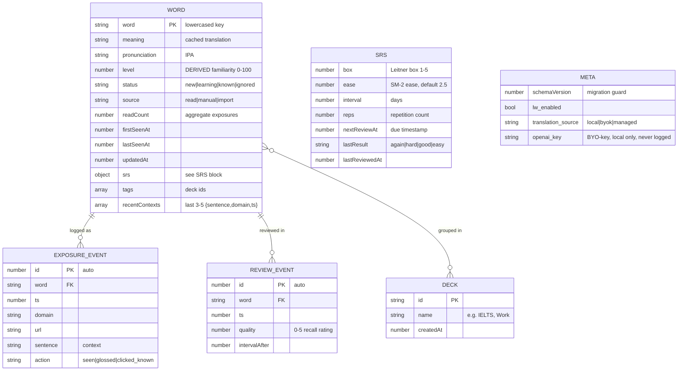
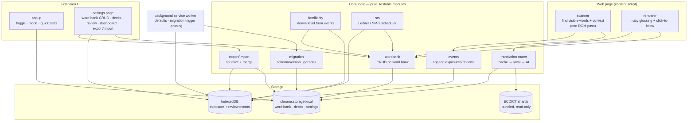
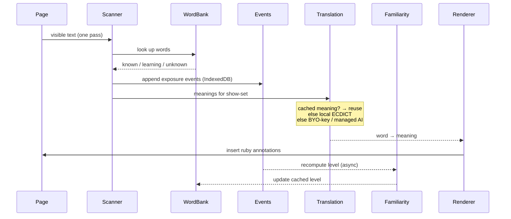
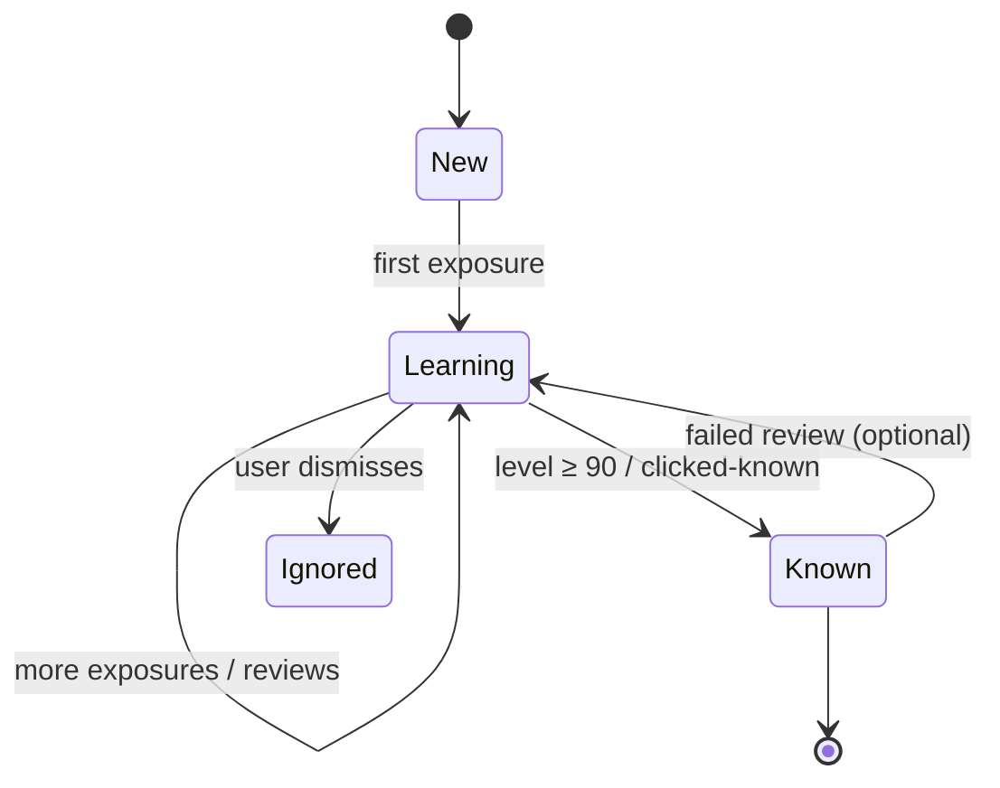

# LearnWise — Technical Design

**Purpose:** the buildable blueprint. The plan (`PLAN.md`) says *what and why*; this says *how it's structured*. Build from this, and update it as the design evolves. Diagrams are written in [Mermaid](https://mermaid.js.org/) — they render in GitHub and in VS Code with a Mermaid preview extension.

---

## 1. Core principle: store facts, derive scores

The mistake to avoid: storing only a computed familiarity number and mutating it. Once overwritten, you can't recompute it with a better formula later.

Instead: **record raw exposure events (when/where/what context), and compute familiarity from them.** `level` becomes a *cached derived value*, not the source of truth. This makes every future feature possible without data migrations:

- Better familiarity formula → recompute from events.
- "Where did I learn this word?" → query the event log.
- Review scheduling (SRS) → another set of events + derived state.
- Translation caching → store each word's meaning once, reuse forever.

---

## 2. Storage layers

Three places data lives, each chosen for its job:

| Layer                  | Holds                                      | Size            | Synced (v2)?            |
| ---------------------- | ------------------------------------------ | --------------- | ----------------------- |
| `chrome.storage.local` | Word bank, decks, settings, schema version | Small, bounded  | Yes (compact, syncable) |
| **IndexedDB**          | Full exposure + review event log           | Large, pruned   | No (local-only)         |
| Bundled ECDICT shards  | Offline dictionary                         | Read-only asset | n/a                     |

The rule: **small + meaningful → `storage.local` (syncable). Large + historical → IndexedDB (local).**

---

## 3. Data model



`srs` is an object embedded on each `WORD` (shown separately for clarity). Storing the full SM-2 fields now means upgrading Leitner→SM-2 is a logic change, not a migration.

### Field reference (interfaces)

```ts
interface Word {
  word: string;                 // key, lowercased
  meaning: string;              // cached primary translation ("" until translated)
  pronunciation: string;        // IPA
  level: number;                // DERIVED 0-100; ≥90 => stop glossing
  status: "new" | "learning" | "known" | "ignored";
  source: "read" | "manual" | "import";
  readCount: number;            // aggregate count of exposures
  firstSeenAt: number;
  lastSeenAt: number;
  createdAt: number;
  updatedAt: number;            // for last-write-wins sync (v2)
  srs: Srs;
  tags: string[];               // deck ids
  recentContexts: Context[];    // bounded cache (full history in IndexedDB)
}

interface Srs {
  box: number;                  // Leitner 1-5 (used first)
  ease: number;                 // SM-2 ease factor, default 2.5 (reserved)
  interval: number;             // days
  reps: number;
  nextReviewAt: number;         // 0 = not scheduled
  lastResult: "again" | "hard" | "good" | "easy" | null;
  lastReviewedAt: number;
}

interface Context { sentence: string; domain: string; ts: number; }

interface ExposureEvent {       // IndexedDB store "events"
  id?: number;
  word: string;
  ts: number;
  domain: string;
  url: string;
  sentence: string;
  action: "seen" | "glossed" | "clicked_known";
}

interface ReviewEvent {         // IndexedDB store "reviews"
  id?: number; word: string; ts: number; quality: number; intervalAfter: number;
}

interface Deck { id: string; name: string; createdAt: number; }
```

IndexedDB indexes: `events` indexed by `word`, `ts`, `domain`; `reviews` indexed by `word`, `ts`.

---

## 4. Component architecture



**Key structural rule:** the **core modules are pure logic with no DOM and no direct Chrome API calls** beyond a thin storage wrapper. That's what makes them unit-testable (Section 7 of the plan). The content script and UI are the "glue" that wires pure logic to the page.

### Target file structure

```
JSs/
  background.js          # service worker: defaults, migration, pruning
  contentScript.js       # thin: wires scanner + renderer + core
  popup.js               # popup UI
  settingsWindow.js      # settings/dashboard/review UI
  core/                  # PURE, TESTABLE — no DOM, no chrome.* except via storage.js
    storage.js           # promise wrappers: storage.local + IndexedDB
    wordbank.js          # word CRUD, status transitions
    events.js            # append/query exposure + review events
    familiarity.js       # derive level from events (pure)
    srs.js               # Leitner now, SM-2 later (pure)
    translation.js       # router: cache → ECDICT → BYO-key/managed
    migration.js         # schemaVersion migrations (pure-ish)
    exportImport.js      # serialize + merge-by-updatedAt
  dom/
    scanner.js           # visible words + context, one pass
    renderer.js          # ruby annotations, click handler
tests/                   # Vitest/Jest — mirrors core/
```

---

## 5. Key flows

### Reading pass (glossing)



### Word lifecycle



### Translation routing

1. Word needs a meaning? Check `word.meaning` cache → if present, **done, no work**.
2. Else by `translation_source`:
   - `local` → ECDICT shard lookup (offline).
   - `byok` → call OpenAI with the user's own key.
   - `managed` → call the paid backend (v2).
3. Store the result into `word.meaning` so step 1 hits next time.

### Export / import

- **Export:** serialize word bank + decks (+ optionally events) → JSON file download.
- **Import:** parse → merge into word bank **by `updatedAt`** (newer wins). Same merge rule the cloud sync will use in v2, so you build the logic once.

---

## 6. How this maps to milestones

| Module / store | Built in | Tested (pure logic) |
|----------------|----------|---------------------|
| `storage.js`, `migration.js`, schemaVersion | M0 | ✅ migration test-first |
| `wordbank.js`, `translation.js` caching | M0 | ✅ |
| `dom/scanner`, `dom/renderer` (one pass) | M0 | manual |
| `events.js` + IndexedDB, `familiarity.js` (derived) | M0–M1 | ✅ |
| `translation.js` BYO-key, onboarding | M1 | ✅ key/error paths |
| `srs.js` (Leitner), review UI, audio | M2 | ✅ scheduling math |
| decks/tags, manual capture, `exportImport.js` | M2 | ✅ merge logic |
| dashboard (reads events + bank) | M3 | ✅ aggregation |
| privacy, store assets, submit | M4 | — |
| paid tier: accounts, sync, managed translations | v2 | ✅ |

The dependency order is the milestone order: **storage + migration first** (everything sits on it), then the word bank and events, then features that read them, then the dashboard that aggregates them, then launch.

---

## 7. Open design choices (don't block on these)

- **Sense disambiguation:** one `meaning` per word now; if you later want per-context meanings, they already live in the events — promote them when needed.
- **Familiarity formula:** start simple (exposures + recency + review results). Because you store events, you can tune it forever.
- **Event pruning policy:** keep full events ~90 days, then collapse older ones into aggregate counts on the `Word`. Tune once you see real data sizes.
- **Backend (v2):** Firebase / Supabase / self-run Node — decide at v2; lean managed.
